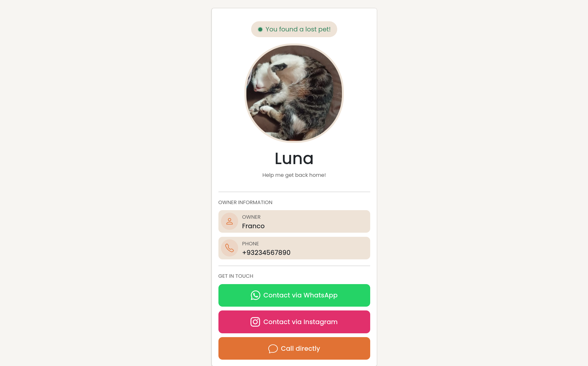
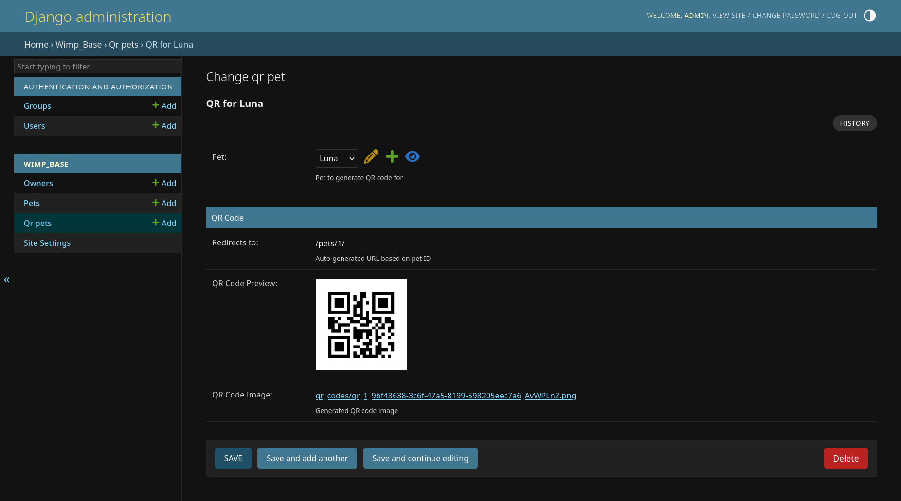

# Where is my pal?

Self-hosted webapp that helps you locate your pet if it gets lost!

## The Solution

"Where is my pal?" allows you to create a QR code that can be attached to your pet's collar. When someone finds your pet, they simply scan the QR code and instantly see your contact information along with your pet's photo and details.

## Features

- **Owner Management** - Store contact information including name, phone number, and Instagram profile
- **Pet Management** - Add pets with photos and link them to their owners
- **Automatic QR Code Generation** - Generate unique QR codes for each pet
- **Public Pet Profiles** - Anyone who scans the QR code sees a clean, mobile-friendly page with pet details and owner contact info
- **Multi-language Support** - Available in English and Spanish
- **Admin Interface** - Easy-to-use Django admin panel for managing all data

## Tech Stack

- **Framework**: Django 6.0.2
- **Language**: Python 3.x
- **Database**: SQLite
- **Image Processing**: Pillow
- **QR Code Generation**: qrcode
- **Phone Numbers**: django-phonenumber-field

## Local Development Setup

### 1. Repo setup
```bash
# Clone the repository
git clone https://github.com/francosorbello/where-is-my-pal.git
cd where-is-my-pal

# Create a virtual environment
python -m venv venv

# Activate the virtual environment
# On Linux/Mac:
source venv/bin/activate
# On Windows:
venv\Scripts\activate

# Install dependencies
pip install -r requirements.txt

# Run migrations
python manage.py migrate

# Create a superuser (admin account)
python manage.py createsuperuser

# Start the development server
python manage.py runserver
```
### 2. Generating a new SECRET_KEY

You'll need a secret key to execute the server. Setup one with the following steps.

```bash
# Open the python shell
python manage.py shell

# Generate a key and copy the result
>>> from django.core.management.utils import get_random_secret_key
>>> print(get_random_secret_key())

# Create a .env file in the root directory
touch .env

# Set the SECRET_KEY variable with your generated key
SECRET_KEY = "<your generated key>"
```

After running these commands:

1. Open your browser and go to `http://127.0.0.1:8000/admin`
2. Log in with the superuser account you created
3. Start by creating an Owner, then add Pets, and generate QR codes

## How It Works

1. **Create an Owner** - Add the pet owner's name, phone number, and optional Instagram handle
2. **Add a Pet** - Create a pet profile with the pet's name and upload a photo
3. **Generate QR Code** - The system automatically creates a unique QR code that links to the pet's public profile
4. **Print and Attach** - Download the QR code, print it, and attach it to your pet's collar
5. **Get Found** - When someone finds your pet, they scan the QR code and see your contact information immediately

## Production setup

This project comes with a Dockerfile already setup to create a production build.

For it to work, the project expects a `secrets.env` file with the following parameters:

```sh
SECRET_KEY="your django secret key"
DJANGO_SUPERUSER_USERNAME="your admin username"
DJANGO_SUPERUSER_EMAIL="your admin mail"
DJANGO_SUPERUSER_PASSWORD="your admin password"
```

This file must be in the **root directory**. An example file is provided in this repo. You may rename it to `secrets.env`.

You can then build and run the project using the following command:
```sh
docker-compose up -d --build
```

> Note: A "prod" folder may be created when you start your docker project. This folder will contain your production database and pet images. Do not delete or you will lose your data if your server goes down.

## Screenshots

### Public Pet Profile


### QR Code Example


## License

This program is free software: you can redistribute it and/or modify it under the terms of the GNU General Public License as published by the Free Software Foundation, either version 3 of the License, or (at your option) any later version.

This program is distributed in the hope that it will be useful, but WITHOUT ANY WARRANTY; without even the implied warranty of MERCHANTABILITY or FITNESS FOR A PARTICULAR PURPOSE. See the GNU General Public License for more details.

You should have received a copy of the GNU General Public License along with this program. If not, see <https://www.gnu.org/licenses/>.
